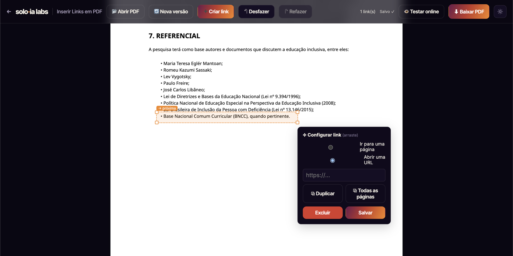

# Gerador de Links em PDF

> Insere áreas clicáveis em PDFs já prontos, direto no navegador.
> Ferramenta interna desenvolvida para a **Solo Propaganda**, parte do hub de ferramentas da agência.

**Stack:** HTML/CSS/JS · pdf.js · pdf-lib
**Status:** em produção

---

## Objetivo

Transformar PDFs de apresentação, proposta ou material de campanha em documentos com **links clicáveis**,
sem precisar reabrir o arquivo no software de diagramação.

## Desafio

PDFs exportados do design saem sem links, ou com links que precisam ser refeitos a cada revisão.
Voltar ao arquivo original só para colocar um endereço é lento, e softwares de edição de PDF
costumam ser pagos ou complicados para quem só quer "colocar um link ali".

Há ainda uma questão de privacidade: materiais de cliente não deveriam ser enviados a sites
desconhecidos de "editar PDF online".

## Solução

- O usuário carrega o PDF, **visualiza as páginas**, desenha a área desejada e informa o link.
- O arquivo é **processado inteiramente no navegador**: o PDF não é enviado a nenhum servidor.
- Renderização das páginas com **pdf.js** e escrita das anotações de link com **pdf-lib**, gerando um novo PDF pronto para baixar.

## Decisões técnicas

- **100% client-side:** sem back-end, sem custo de hospedagem de arquivos, sem risco de vazamento de material do cliente.
- Duas bibliotecas especializadas (uma para ler/mostrar, outra para escrever), em vez de uma solução única que faria as duas coisas mal.

## Imagens

