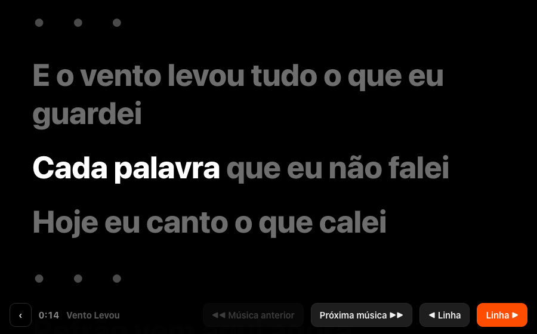
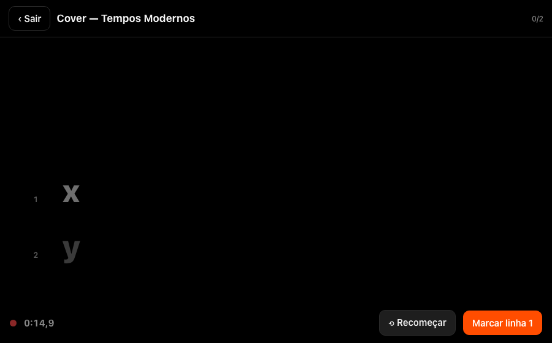
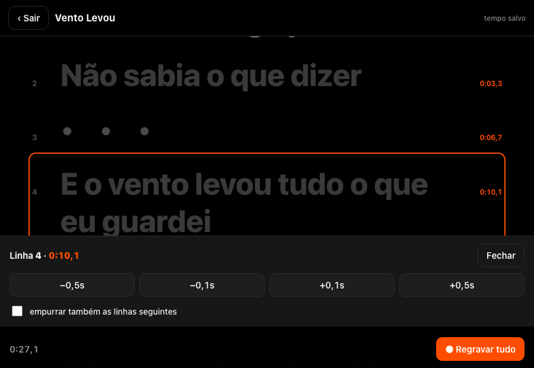

# Letras Palco — Teleprompter de Palco

> App que rola a letra da música **no tempo em que a banda toca**, não no tempo da gravação original.
> Produto da operação **Social Labs MKT**.

**Stack:** HTML/CSS/JS · PWA (Service Worker, offline-first) · API LRCLIB
**Status:** no ar (Cloudflare Pages), pensado para iPad

---

## Objetivo

Dar a músicos um teleprompter confiável para tocar ao vivo, que funcione **sem internet, sem conta e sem servidor**.

## Desafio

Os apps de letra sincronizada seguem o tempo da gravação de estúdio. Uma banda ao vivo nunca toca
exatamente nesse andamento: tem introdução mais longa, parada, repetição de refrão. A letra "foge" do músico.

Além disso, o palco é um ambiente hostil para tecnologia: Wi-Fi ruim ou inexistente, mãos ocupadas
com instrumento, pouca luz. O app não pode depender de nada externo na hora do show.

## Solução

- **Gravação do tempo da própria banda:** o músico toca na tela (ou no pedal) a cada troca de linha durante o ensaio. A letra passa a seguir o andamento *deles*.
- **Funciona offline:** instalado como PWA, tudo roda localmente.
- **Pedal Bluetooth:** pedais comuns se comportam como teclado, então funcionam sem configuração.
- **Busca de letra** no acervo aberto LRCLIB, trazendo, quando existe, a letra já sincronizada como ponto de partida; letra autoral pode ser colada à mão.
- **Correção fina:** ajuste de ±0,1 s / ±0,5 s por linha, com opção de empurrar as linhas seguintes.
- **Modo manual:** sem tempo gravado, cada toque avança uma linha. Dá para usar já no primeiro ensaio.

## Detalhe que fez diferença

A regra da "linha acesa" segue a lógica de um karaokê: **durante a introdução quem acende é a pausa, não a primeira frase**. Sem esse detalhe, a letra inteira ficava adiantada pela duração da introdução.

## Imagens

| Palco | Gravando o tempo | Ajuste por linha |
|---|---|---|
|  |  |  |
