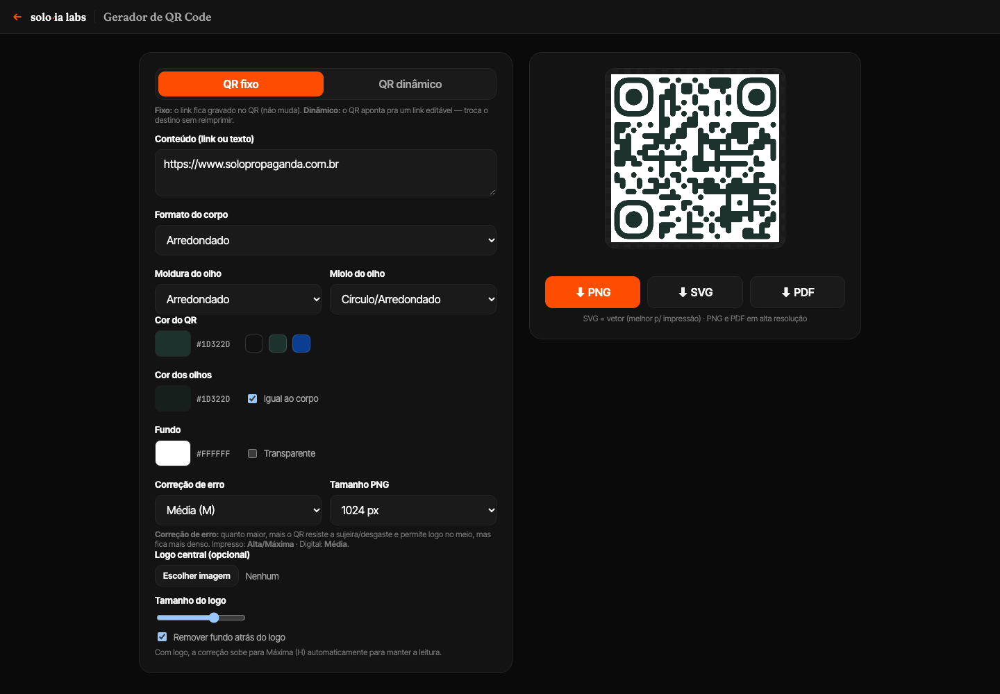

# QR Code Dinâmico

> Gerador de QR Codes cujo destino pode ser alterado depois da impressão.
> Ferramenta interna desenvolvida para a **Solo Propaganda**, parte do hub de ferramentas da agência.

**Stack:** HTML/CSS/JS · PHP · MySQL · qr-code-styling · jsPDF
**Status:** em produção

---

## Objetivo

Permitir que a equipe da agência gere QR Codes personalizados com a identidade visual do cliente
e, principalmente, **corrija ou troque o link depois que a peça já foi impressa**.

## Desafio

Um QR Code comum guarda o endereço dentro do próprio desenho. Se o link muda ou foi digitado errado,
a peça impressa (cartaz, embalagem, flyer) fica inútil e precisa ser reimpressa.

Além disso, as agências costumam usar geradores públicos genéricos, sem controle de marca, sem saber
quantas pessoas leram o código e sem poder pausar uma campanha que acabou.

## Solução

A ferramenta tem dois modos:

- **Fixo:** gera o QR direto no navegador, sem servidor, com cores, formato dos módulos e logotipo personalizados.
- **Dinâmico:** o QR aponta para um endereço curto da agência (`/r/<código>`). Esse endereço **redireciona** para o destino real, que pode ser editado a qualquer momento. A imagem do QR nunca muda.

No modo dinâmico cada código tem:

- destino editável;
- título amigável (ex.: "Campanha Natal");
- **pausar sem apagar**;
- **contador de acessos** e data do último acesso;
- o estilo do QR salvo, para reabrir e baixar de novo idêntico;
- exportação em imagem e PDF.

## Decisões técnicas

- **PHP + MySQL no próprio servidor da agência** em vez de um serviço externo: sem mensalidade, sem depender de terceiros, dados da agência ficam com a agência. (O plano original previa Supabase; foi trocado após avaliar a infraestrutura já disponível.)
- **API única em JSON** com ações explícitas (`list`, `get`, `create`, `update`, `delete`), validação de URL e geração de código curto com checagem de duplicidade.
- **Modo fixo 100% no navegador**: nada sai da máquina do usuário.

## Imagens

